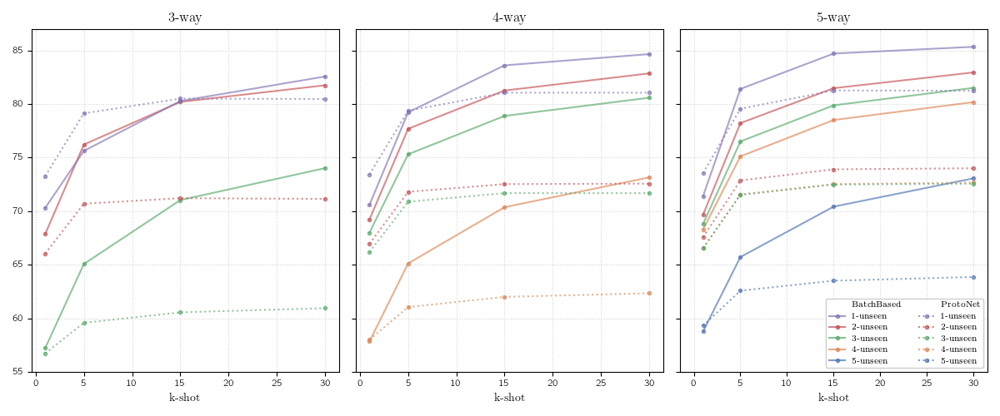

# MetaChest: Generalized few-shot learning of patologies from chest X-rays

By [Berenice Montalvo-Lezama](https://turing.iimas.unam.mx/~bereml/) and
[Gibran Fuentes-Pineda](http://turing.iimas.unam.mx/~gibranfp/).

This repo reproduces the main results of [MetaChest: Generalized few-shot learning of patologies from chest X-rays]().

A description of the MetaChest dataset can be found in the [site](https://bereml.github.io/metachest/).




## Reproducing Results

To run the following experiment, you will need 120GB of free space.

1. Download [MetaChest](https://bereml.github.io/metachest/) dataset.


2. Set the MetaChest directory in `config.toml`.

```toml
metachest_dir = "/path/to/metachest"
```

3. Create and activate the enviroment:

```sh
conda env create -f env.yml
conda activate meta-cxr
```

4. Run the experiment:
```sh
python experiment.py
```

5. The results are saved to `results` directory.


<!-- ## Citing
If you find this work useful in your research, please consider citing.

```
@article{Trailers12k-2023103343,
title = {MetaChest: Generalized few-shot learning of patologies from chest X-rays}
}
``` -->
